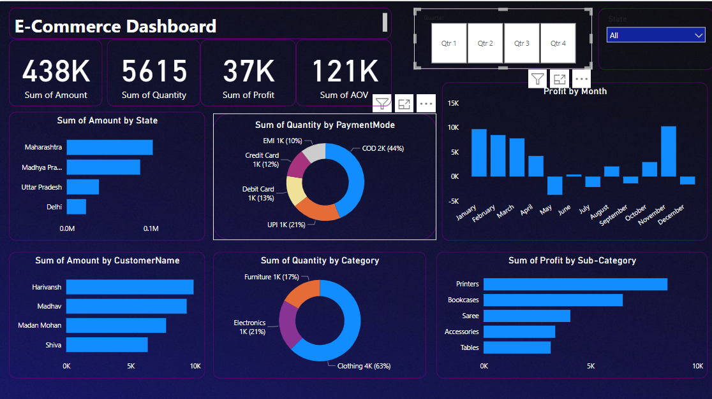
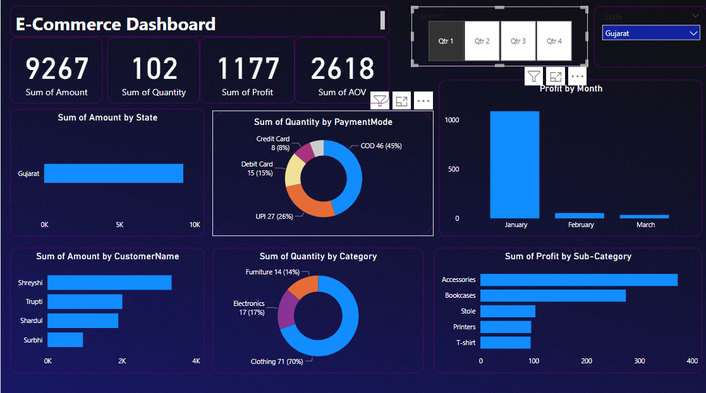

# E-Commerce Sales Dashboard

## Power BI File
The Power BI file "Ecommerce Sales.pbix" contains the dashboard visualization and can be found in the root directory.

## Data
The data for this dashboard is stored in two files located in the "data" folder:
- **Details.csv**: Contains information about individual orders.
- **Orders.csv**: Contains details about each order such as order date, customer name, state, and city.

## Dashboard Snapshots

For all states and complete year

For the state of Gujrat in first quarter

